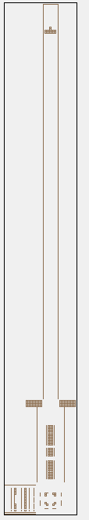

# LAS-Ion-Optics-CTS
This repository is for storing the SIMION simulations for the LAS Calgary Test Stand (CTS) ion optics. This repository covers all simulations for the full test stand drift length, when the ions fly down the extended 2ft drift tube before collection. As such, only one gem file `TITAN-LAS.gem` should be in this repo. This will be stored in the root directory. There may be several operational modes (e.g. for MRTOF or for MPET etc.) and each mode will have its own workbench in a sub-directory of the repo. The sections below are for documentation of the geometry and each workbench. When you update the geometry or add/modify a workbench, please update the relevant section of this README.

The `.gitignore` file is configured to ignore all the `.pa` files since they are large and take a long time to upload. This means that if you pull a new version of the geometry, you must repeat the refining process from the `.gem` file. Once this is done, the workbench should work with the new `.pa` files.

## Geometry Log
This section tracks the geometry file `TITAN-LAS.gem`. This is the only geometry file in the repo. If you are making changes, make a branch and then merge when your edits are complete.

The geometry consists of:
* Ablation target where the ions are created
* Stack of 5 concentric ring electrodes for extraction and acceleration with final electrode segmented for steering
* Quadrupole 90 degree bender inside of a box for shielding
* Split einzel lens for focus and steering of ions after bending
* 2ft Drift Tube for mass separation 
* Faraday cup for ion detection at the far end of the drift tube

The geometry is adapted from the CAD model: `\\trwinfs.triumf.ca\titan\LAS Nov4, 2021\MRTOF LaserModsMainAssy\MRTOF_LaserModsMain Assy.STEP`

## Workbench Log

### Sandbox-1300eV
This workbench assumes a bias of 1300 V on the input RFQ aperture which would be used for sending ions to MRTOF. In this scheme, the quadrupole bender box is at earth ground, and the ion energy is set by the target holder bias (slightly greater than 1300 V). This means the ions are accelerated to the full energy before entering the bender. The ions are focused by the final 3 extraction electrodes acting as lens triplet, and focused again after bending by the split einzel lens to make it into the input RFQ. 

This workbench has a user program that defines some helpful variables for playing aroud with voltages by hand to get an idea of what happens. These are:
- **bender:** adjusts all the bender quadrupole voltages to the same voltage with the proper polarity for bending
- **sel_focus:** adjusts all center segments of the SEL to this voltage for primary focusing
- **sel_x:** symetrically adjusts the SEL steering in the x direction (positive steers right)
- **sel_z:** symetrically adjusts the SEL steering in the z direction (positive steers up)

### IonInitialConditions

### IonTOFResolvability
This directory stores python simulation of the time of flight and separation power of the test stand as a function of the drift tube length. See README within for more detail.

### TuningScans/BenderSel2DScan 
Several 2D scans of the bender voltages coupled with the split einzel lens focusing voltage were performed, however changing the bender voltage from 920V proved to impact the steering rather than the focusing of the beam. Given that a change in steering was undesired, this scan was abandoned to return to investigations of the split einzel lens' sole focusing ability.

### TuningScans/DeflectorCollector2DScan
Lensing into the faraday cup aperture was attempted by placing potentials on the faraday cup collector and deflector in a 2D scan. No significant effect or pattern on the efficiency across a range of 0-1000V on the deflector and -500V-500V on the collector was observed.

### TuningScans/ExtractionSteering2DScan
This workbench scans the extraction steering in both axes for each location on the target (4 axis scan). The ion's displacement from the axis at the middle of the SEL is recorded and used as the metric for selecting the optimal settings. It looks like there is some coupling between the steering and ion location axes, so we need settings for each steerer that depend on both coordinates of the ablation location.

### TuningScans/SelSteering2DScan
Numerous scans of the SEL steering voltages coupled with the ion initial position on the target were performed to determine optimal steering for each spot on the target surface. The scan with a voltage range of +-100V and 32 steps proved to miss the faraday cup aperture for many positions and demonstrated that a smaller step size was required. For the data points collected in this scan that did pass through the faraday cup, the voltage ranges appeared to stay within +-50V so a new scan was performed within a voltage range of +-50V and 40 total voltage steps. The optimal split einzel lens voltage for each initial ion position was then fitted using a 3rd order polynomial model. However, the fit was not accurate and upon testing it with SelSteeringTester the efficiency of ions getting from the split einzel lens to the faraday cup aperture was zero. A new scan was started with 65 npoints 41 nvolts and a voltage range of 45. This scan took much longer but provided a resulting fit that was considerably better than the previous one. Despite this improvement in the fit, the tune generated was still unable to consistently send ions into the faraday cup aperture. It was noted that the tune in the x direction was quite good, however the z component was a few milimeters off such that ions would impact the deflector electrode at the end of the drift tube, almost making it to the faraday cup aperture. As a result, the faraday cup collecter aperture was increased in the geometry file. 

### TuningScans/SelSteeringTester
Upon completion of the sel steering scan and fit for optimal voltages, the model is tested on how accurately it places ions in the center of the faraday cup aperture. A grid of points on the target is specified and the script runs throguh each point, testing the fit and writing the ion's distance off axis from the center of the aperture to a file. 

## Jupyter Notebooks

### SteeringVoltagePolyFitter
This notebook takes the data from the 2D scans in the `TuningScans` folder and fits a polynomial surface of arbitrary degree to the simulated data. This allows us to find an equation to map the ion start position to the optimal steering voltages determined by the scan. It appears a 3rd order polynomial in both axes is best for fitting the data. A template for this notebook is available to copy into the directory containing your scan data. 
[Template](TuningScans/SteeringVoltagePolyFitter_template.ipynb)
